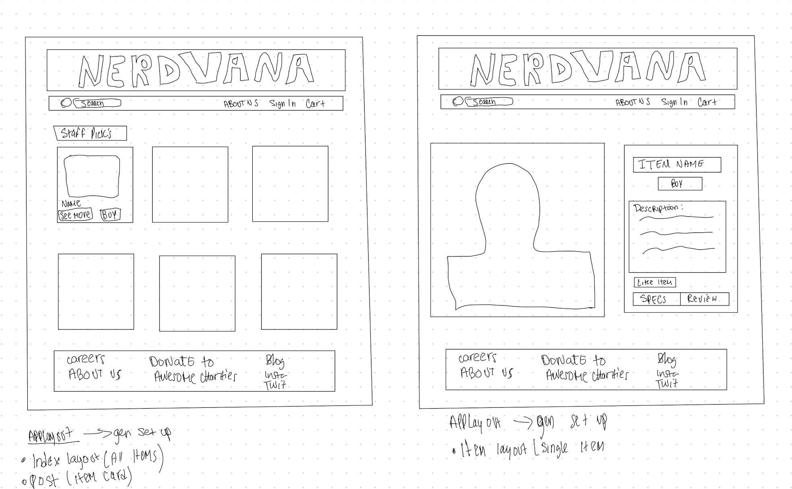

💃 🙃

# App Title: Nerdvana
#### A store for all things techy and nerdy. I do not own media.

### App Demo: Not Hosted
--------------
### Concept:
The goal of the store is to create a full CRUD project using JS, MongoDB and JSX/Node. 

### TLDR:
Nerdy tech store. 

### Technologies Used:
- HTML 
- CSS 
- JavaScript 
- React
- Express 
- Mongoose / MongoDB
- Packages Installed:
        Gulp, React, React-DOM, DotEnv, Express-React-Views, Method-Override
        

### Credits:
- Sideshow website
- Buffy Vampire Slayer 

### Approach:

Inside the mongoose_store folder, set up Express with MVC architecture with the appropriate folders for models, views, and controllers.

Need to create seven RESTful routes. You can begin with your data-layer and test that everything works with cURL or Postman. Don't worry about what the BUY button does or where it goes just yet. Just set up your regular RESTful stuff.

Make a Mongoose Schema in a products.js file for your products. The schema should have:

Set up validations for the price and qty (can't be less than zero) and make the name a required field.

Create a model and export it.

Connect to your Mongo server in server.js

Ensure controller can access your model:

    const Product = require('./models/products');

#### Wireframe

#### Minimum Viable Product TBC
- Index Page where all products are displayed 
- Show Page where individual product shows, buy/delete/stock is visible
- New & Edit Page where new item can be added and existing item can be amended 
- Redirects: Create and Delete route should direct user to index
